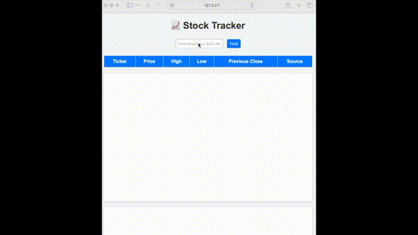

# Stock Tracker API

A fast, reliable stock tracking system built with FastAPI and Redis. It fetches and caches stock prices in real-time, allowing quick and efficient access to the latest market data.

## Features

- Real-time stock price retrieval  
- Rate-limited API to prevent abuse  
- Redis caching for fast responses  
- Simple, extensible Python codebase

## Demo


## Tech Stack

- FastAPI  
- Redis  
- Python 3.11+  
- Requests (for fetching stock data)

## Getting Started

1. Clone the repo
2.	Create and activate a virtual environment
3. Install dependencies with `pip install -r requirements.txt`
4. Configure environment variables in .env (e.g., API keys)
5.	Run the app with:
    ```bash
    uvicorn app:app --reload
6.	Access the API docs at http://127.0.0.1:8000/docs

### API Endpoints
- **GET /** - Check if API is running  
- **POST /stock** - Retrieve the latest stock price for a given symbol.

#### Example Request:
```json
{
  "symbol": "AAPL"
}
```

#### Example Response:
```json
{
  "symbol": "AAPL",
  "price": 175.23,
  "timestamp": "2025-08-21T15:30:00"
}
```

## License
MIT License © Ashpreet Chahal